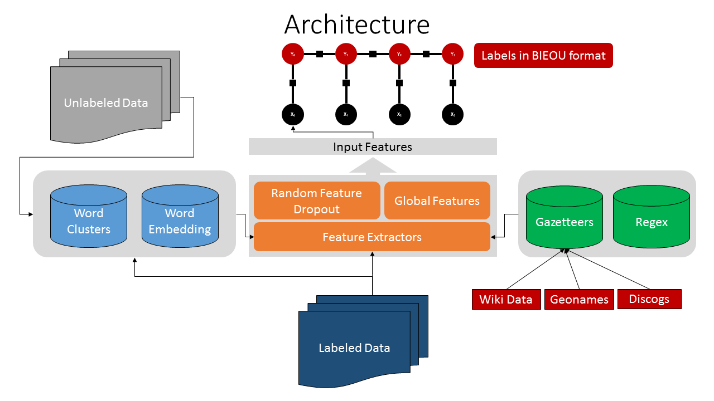

# TwitterNER [](https://zenodo.org/badge/latestdoi/68426556) 
Twitter named entity extraction for WNUT 2016 http://noisy-text.github.io/2016/ner-shared-task.html and the corresponding workshop paper at WNUT COLING 2016, titled **[Semi-supervised Named Entity Recognition in noisy-text by Shubhanshu Mishra and Jana Diesner](http://aclanthology.info/papers/semi-supervised-named-entity-recognition-in-noisy-text)**



## Installation

```
pip install future gensim scikit-learn regex matplotlib seaborn sklearn-crfsuite jupyter joblib
wget http://nlp.stanford.edu/data/glove.twitter.27B.zip
unzip glove.twitter.27B.zip
```

## Usage

```
>>> from run_ner import TwitterNER
>>> from twokenize import tokenizeRawTweetText
>>> from run_ner import TwitterNER
>>> ner = TwitterNER()
>>> tweet = "Beautiful day in Chicago! Nice to get away from the Florida heat."
>>> tokens = tokenizeRawTweetText(tweet)
>>> ner.get_entities(tokens)
[(3, 4, 'LOCATION'), (11, 12, 'LOCATION')]
>>> " ".join(tokens[3:4])
'Chicago'
>>> " ".join(tokens[11:12])
'Florida'
```

## Data download

The dataset used in this repository can bs downloaded from https://github.com/aritter/twitter_nlp/tree/master/data/annotated/wnut16

## Submitted Solution [ST]
See `Word2Vec.ipynb` for details on the original submitted solution for the task. 

## Improved model
See `Run Experiments.ipynb` for the details on the improved system.
See `Run Experiment.ipynb` for the details on the improved system with test data.

## Using the API
The final system is packaged as an API specified in the folder NoisyNLP. More updates will be made to the API in upcoming days. 
See `Run Experiment.ipynb` for API usage. 

## Downloading Gazetteers
See `Updated Gazetteers.ipynb`, `Extra Gazetteers.ipynb`, `Download Wikidata.ipynb`

## Generating word clusters
See `Gen new clusters.ipynb`

## Data Pre-processing
See `Data preprocessing.ipynb`

## Preliminary comparison with RNN models
See `KerasCharRNN.ipynb`, and `KerasWordRNN.ipynb`


Please cite as:

```
@INPROCEEDINGS {mishra2016_wnut_ner,
    author    = "Shubhanshu Mishra and Jana Diesner",
    title     = "Semi-supervised Named Entity Recognition in noisy-text",
    booktitle = "Proceedings of the 2nd Workshop on Noisy User-generated Text (WNUT)",
    publisher = "The COLING 2016 Organizing Committee",
    pages     = "203-212",
    url       = "http://aclweb.org/anthology/W16-3927",
    year      = "2016",
    month     = "dec"
}
```
